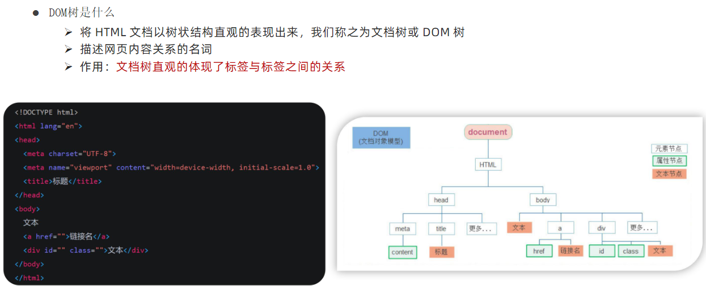
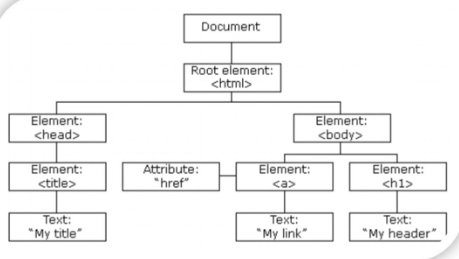

# 01.API的基本认知

### 1.1 作用与分类

作用：使用JS去操作html和浏览器 
分类: DOM (页面文档对象模型) BOM (浏览器对象模型)

### 1.2 DOM树

### 1.3 DOM对象

- DOM 对象：浏览器根据html标签生成的JS对象
    - 所有标签属性都可以在这个对象上面找到
    - 修改这个对象的属性会自动映射到标签身上
- DOM 的核心思想：把网页内容当做对象来处理
- document 对象
    - 是DOM里提供的一个对象
    - 他提供的属性和方法都是用来访问和操作网页内容的
    - 网页所有内容都在document里

