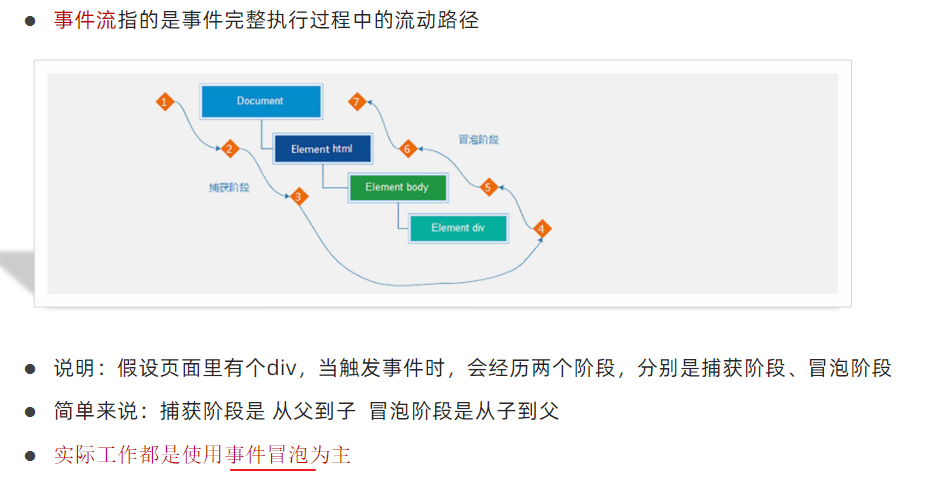
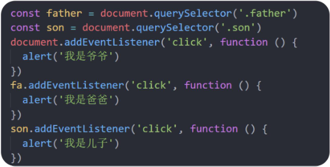
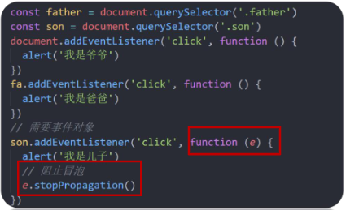
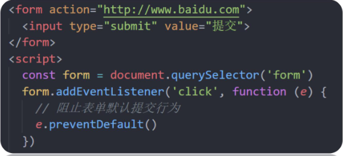
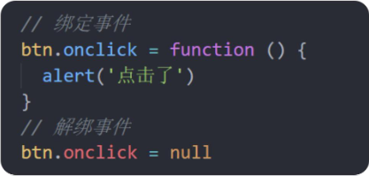
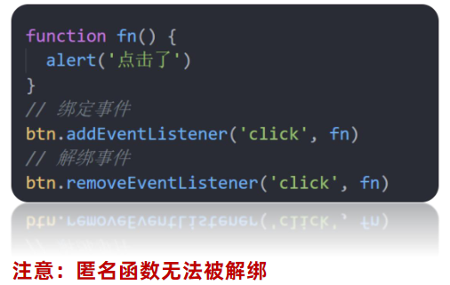

# 12.事件流

### 12.1 事件流和两个阶段说明



### 12.2 事件捕获

- 事件捕获概念：从DOM的根元素开始去执行对应的事件 (从外到里)

```JavaScript
    DOM.addEventListener(事件类型, 事件处理函数, 是否使用捕获机制)
```

- addEventListener第三个参数传入 true 代表是捕获阶段触发（很少使用）
- 若传入false代表冒泡阶段触发，默认就是false
- 若是用 L0 事件监听，则只有冒泡阶段，没有捕获

### 12.3 事件冒泡

- 当一个元素的事件被触发时，同样的事件将会在该元素的所有祖先元素中依次被触发。这一过程被称为事件冒泡
- 简单理解：当一个元素触发事件后，会依次向上调用所有父级元素的 同名事件
- 事件冒泡是默认存在的



### 12.4 阻止冒泡

- 问题：因为默认就有冒泡模式的存在，所以容易导致事件影响到父级元素
- 需求：若想把事件就限制在当前元素内，就需要阻止事件冒泡
- 前提：阻止事件冒泡需要拿到事件对象

```
事件对象.stopPropagation()
```

- 注意：此方法可以阻断事件流动传播，不光在冒泡阶段有效，捕获阶段也有效



### 12.5 阻止默认行为

- 我们某些情况下需要阻止默认行为的发生，比如 阻止 链接的跳转，表单域跳转

```
e.preventDefalut()
```



### 12.6 解绑事件

#### on事件方式
- 直接使用null覆盖就可以实现事件的解绑



#### addEventListener方式

```
removeEventListener(事件类型, 事件处理函数, [获取捕获或者冒泡阶段])
```



### 12.7 鼠标经过事件区别

- mouseover 和 mouseout 会有冒泡效果
- mouseenter 和 mouseleave 没有冒泡效果 (推荐)