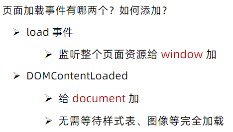

# 14.页面加载事件

#### 14.1 load
- 加载外部资源（如图片、外联CSS和JavaScript等）加载完毕时触发的事件
- 为什么要学？
    - 有些时候需要等页面资源全部处理完了做一些事情
    - 老代码喜欢把 script 写在 head 中，这时候直接找 dom 元素找不到<br/>
- 事件名：load
- 监听页面所有资源加载完毕：给 window 添加 load 事件<br/>

```
//  页面加载事件
windows.addEventListener('load', function(){
    // 执行的操作
})
```
- 注意：不光可以监听整个页面资源加载完毕，也可以针对某个资源绑定load事件

#### 14.2 DOMContentLoaded

- 当初始的 HTML 文档被完全加载和解析完成之后，DOMContentLoaded 事件被触发，而无需等待样式表、图像等完全加载
- 事件名：DOMContentLoaded
- 监听页面DOM加载完毕：给 document 添加 DOMContentLoaded 事件

```
windows.addEventListener('DOMContentLoaded  ', function(){
    // 执行的操作
})
```

