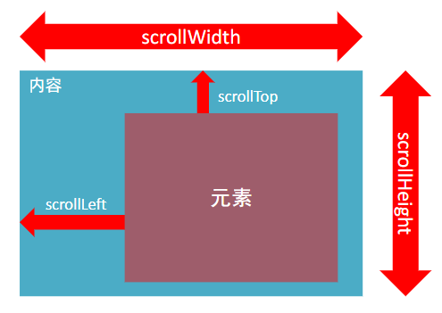
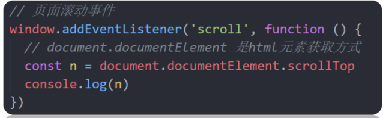
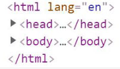

# 15.页面滚动事件

### 15.1 scroll
- 滚动条在滚动的时候持续触发的事件
- 为什么要学？
    - 很多网页需要检测用户把页面滚动到某个区域后做一些处理， 比如固定导航栏，比如返回顶部

```
document.addEventListener('scroll', function(){
    // 执行的操作
})
```

- 给 window 或 document 添加 scroll 事件
- 监听某个元素的内部滚动直接给某个元素加即可


### 15.2 scrollLeft和scrollTop(属性)
- 属性：
    - 获取被卷去的大小
    - 获取元素内容往左、往上滚出去看不到的距离
    - 这两个值是可读写的
- 尽量在scroll事件里面获取被卷去的距离

```
document.addEventListener('scroll', function(){
    consle.log(this.scrollTop)
})
```



- 开发中，我们经常检测页面滚动的距离，比如页面滚动100像素，就可以显示一个元素，或者固定一个元素




- 注意：document.documentElement  HTML文档返回为HTML元素



### 15.3 scrollTo() 滚动到指定的坐标

- scrollTo() 方法可把内容滚动到指定的坐标

```
// 让页面滚动到y轴1000px的位置
window.scrollTo(0, 1000)
```