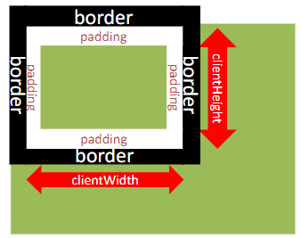

# 16.页面尺寸事件

- 会在窗口尺寸改变的时候触发事件

```
document.addEventListener('resize', function(){
    // 执行的代码
})
```

- 检测屏幕宽度：
```
document.addEventListener('resize', function(){
    let w = document.documentElement.clientWidth
    console.log(w)
})
```

- 获取宽高：clientWidth和clientHeight
    - 获取元素的可见部分宽高（不包含边框，margin，滚动条等）

