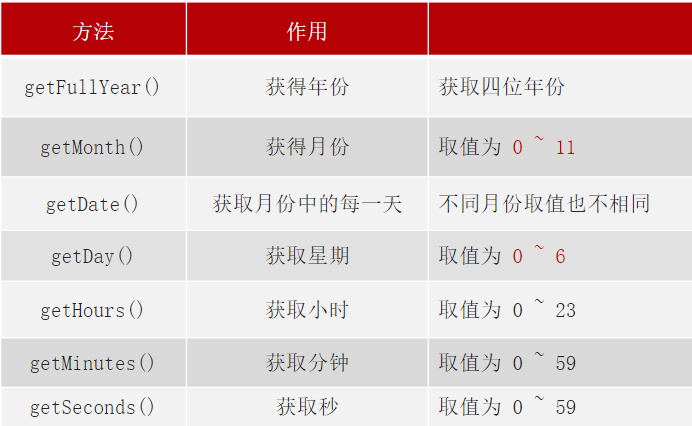

# 18.日期对象

### 18.1 实例化

- 在代码中发现了 new 关键字时，一般将这个操作称为实例化
- 创建一个时间对象并获取时间
    - 获得当前时间
    ```
    const date = new Date()
    ```
    - 获取指定时间
    ```
    const date = new Date('2008-08-08')
    consle.log(date)
    ```

### 18.2 日期对象方法




### 18.3 时间戳

- 使用场景：如果计算倒计时效果，前面方法无法直接计算，需要借助于时间戳完成
- 什么是时间戳: 是指1970年01月01日00时00分00秒起至现在的毫秒数，它是一种特殊的计量时间的方式
- 算法：
    - 将来的时间戳 - 现在的时间戳 = 剩余时间毫秒数
    - 剩余时间毫秒数 转换为 剩余时间的 年月日时分秒 就是 倒计时时间

- 三种方法获得时间戳：
    - getTime() 方法
    ```
    const date = new Date()
    consle.log(date.getTime())
    ```
    - 简写
    ```
    consle.log(+new Date())
    ```
    - Date.now() 方法
        - 无需实例化
        - 但是只能得到当前的时间戳， 而前面两种可以返回指定时间的时间戳
    ```
    consle.log(Date.now())
    ```

- 转换时间戳：
    - d = parseInt(总秒数/ 60/60 /24); // 计算天数
    - h = parseInt(总秒数/ 60/60 %24) // 计算小时
    - m = parseInt(总秒数 /60 %60 ); // 计算分数
    - s = parseInt(总秒数%60); // 计算当前秒数