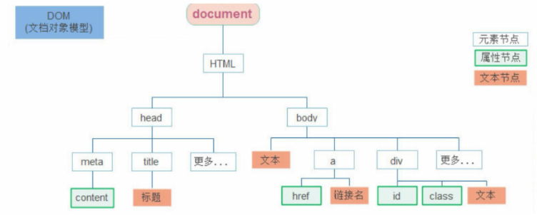

# 19.节点操作

### 19.1 DOM节点

- DOM节点：DOM树里每一个内容都称之为节点
- 节点类型：
    - 元素节点
        - 所有的标签 比如 body,div
        - html 是根节点
    - 属性节点
        - 所有的属性 比如 href,class
    - 文本节点
        - 所有的文本
    - 其他



### 19.2 查找节点
- 父节点查找：
    - parentNode 属性
    - 返回最近一级的父节点 找不到返回为null
    ```
    子元素.parentNode
    ```

- 子节点查找：
    - childNodes
        - 获得**所有**子节点、包括文本节点（空格、换行）、注释节点等
    - children 属性 （重点）
        - 仅获得所有元素节点
        - 返回的还是一个伪数组
    ```
    父元素.children
    ```

- 兄弟关系查找：
    - 下一个兄弟节点： nextElementSibling 属性
    - 上一个兄弟节点： previousElementSibling 属性

### 19.3 增加节点

- 很多情况下，我们需要在页面中增加元素
    - 比如，点击发布按钮，可以新增一条信息
    - 一般情况下，我们新增节点，按照如下操作
        - 创建一个新的节点
        - 把创建的新的节点放入到指定的元素内部

#### 19.3.1 创建节点

- 一般先创建节点，然后插入节点

```
// 创建一个新的节点
document.createElement('标签名')
```

#### 19.3.2 追加节点
- 要想在界面看到，还得插入到某个父元素中

```
//插入到父元素的最后一个子元素
父元素.appendChild(要插入的元素)
```

```
// 插入到父元素中某个子元素的前面
父元素.insertBefore(要插入的元素，在哪个元素前面)
```

#### 19.3.3 复制节点

- 特殊情况下，我们新增节点，按照如下操作：
    - 复制一个原有的节点
    - 把复制的节点放入到指定的元素内部

- 克隆节点
```
元素.cloneNode(bool值)
```

- cloneNode会克隆出一个跟原标签一样的元素，括号内传入布尔值
    - 若为true，则代表克隆时会包含后代节点一起克隆
    - 若为false，则代表克隆时不包含后代节点
    - 默认为false

### 19.4 删除节点
- 在 JavaScript 原生DOM操作中，要删除元素必须通过父元素删除

```
父元素.removeChild(要删除的元素)
```
- 注意：
    - 在 JavaScript 原生DOM操作中，要删除元素必须通过父元素删除
    - 删除节点和隐藏节点（display:none） 有区别的： 隐藏节点还是存在的，但是删除，则从html中删除节点