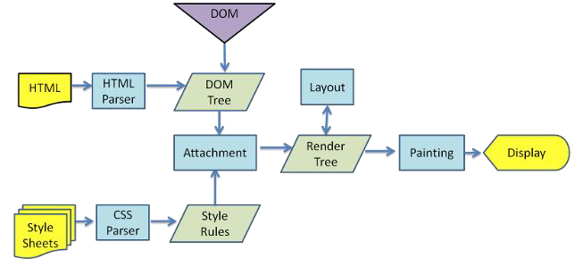

# 21.重绘和回流

### 浏览器是如何进行渲染的

    - 解析（Parser）HTML，生成DOM树(DOM Tree)
    - 同时解析（Parser） CSS，生成样式规则 (Style Rules)
    - 根据DOM树和样式规则，生成渲染树(Render Tree)
    - 进行布局 Layout(回流/重排):根据生成的渲染树，得到节点的几何信息（位置，大小）
    - 进行绘制 Painting(重绘): 根据计算和获取的信息进行整个页面的绘制
    - Display: 展示在页面上

### 回流(重排)
当 Render Tree 中部分或者全部元素的尺寸、结构、布局等发生改变时，浏览器就会重新渲染部分或全部文档的过程称为 回流。

### 重绘
由于节点(元素)的样式的改变并不影响它在文档流中的位置和文档布局时(比如：color、background-color、outline等), 称为重绘。

**重绘不一定引起回流，而回流一定会引起重绘**

- 会导致回流（重排）的操作：
    - 页面的首次刷新
    - 浏览器的窗口大小发生改变
    - 元素的大小或位置发生改变
    - 改变字体的大小
    - 内容的变化（如：input框的输入，图片的大小）
    - 激活css伪类 （如：:hover）
    - 脚本操作DOM（添加或者删除可见的DOM元素）
- 简单理解影响到布局了，就会有回流