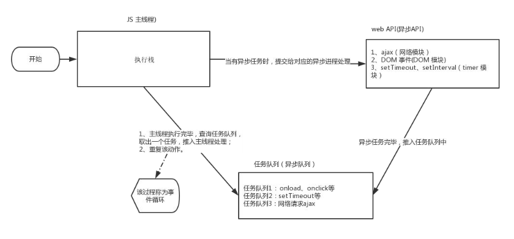

# 03.JS执行机制

### 3.1 关于JavaScript
Javascrit是一门单线程语言，单线程就章味着，所有任务都需要排队，前一个任务结束才会执行下一个务，如果前面任务耗费的时间很长，那后面的任务就得一直等着，这样很明显会造成资源分配的浪费。所以JavaScript语言设计者为了规避这个问题，把JavaScript这边所有的任务可以分成两种，分别为同步任务和异步任务。
- **同步任务**: 在主线程上排队的任务，前一个任务执行完毕，才能继续执行下一个任务。
- **异步任务**:不进入主线程，是进入任务队列的任务，只有任务队列通知主线程，某个异步任务可以执行了，任务才会进入主线程去执行。

### 3.2 事件循环 (EventLoop)

- 先执行同步操作，异步操作排在事件队列里
    1. 先判断是同步还是异步任务，同步任务就进入主线程，异步任务就进入Event Table
    2. 异步任务在Event Table中注册事件，当满足触发条件的时候，会被推入到Event Queue
    3. 同步任务进入到主线程中执行，当主线程空闲时，才会去Event Queue中看是否有需要执行的异步任务，如果有，就推入主线程中执行

### 3.3 宏任务和微任务
- 异步任务分为: 宏任务和微任务
- 那么什么是宏任务什么是微任务?
    - 宏任务: setTimeout、setlnterval、整体代码script
    - 微任务: Promise().then
    - 执行顺序: 先执行微任务然后再执行宏任务

### 3.4 总结

1. 同步先执行，异步后执行
2. 遇到new Promise直接执行，then中的方法直接放入微任务队列中
3. 遇到setTimeout放入宏任务队列中
4. 执行顺序· 同步-->微任务(promise then)-->宏任务(setTimeout)