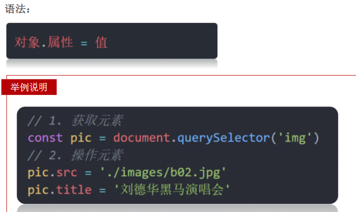
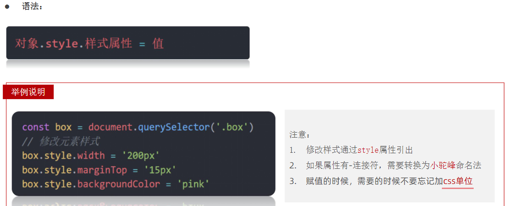
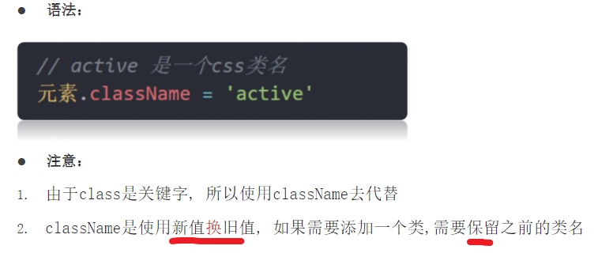
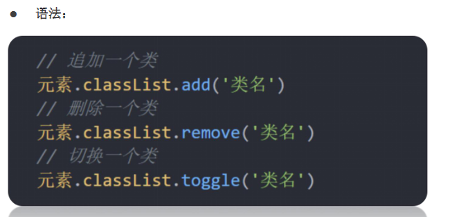

# 04.操作元素属性

### 4.1 操作元素常用属性

### 4.2 操作元素样式属性

#### 通过style属性操作css

#### 操作类名(className)操作CSS
- 如果修改的样式比较多，直接通过style属性修改比较繁琐，我们可以通过借助于css类名的形式。

#### 通过 classList 操作类控制CSS

- 为了解决className 容易覆盖以前的类名，我们可以通过classList方式追加和删除类名。

