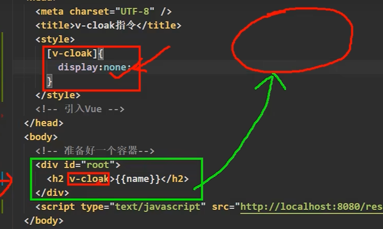

# 11. 内置指令

### 11.1 回顾已学过的指令

```v-bind```:单向绑定解析表达式，可简写为```:xxx```

```v-model```:双向绑定

```v-on```:事件绑定，可简写为```@xxx```

```v-if```:条件渲染，根据表达式的值决定是否渲染元素

```v-for```:循环渲染，根据数组或对象渲染元素

```v-show```:条件渲染，根据表达式的值决定是否显示元素，与```v-if```不同的是，```v-show```元素始终会被渲染并保留在DOM中，只是简单地切换元素的```display```属性值。


### 11.2 v-text

```v-text```指令用于将数据绑定到元素的```textContent```属性上。

- 向其所在的节点中渲染文本内容
- 与插值语法区别：v-text会替换掉元素的所有子节点，而插值语法只是替换掉元素的```textContent```属性。


### 11.3 v-html

```v-html```指令用于将数据绑定到元素的```innerHTML```属性上。

- 向其所在的节点中渲染HTML内容
- 与插值语法区别：
    - v-html会替换掉节点中所有的内容
    - v-html可以识别标签，因此可以渲染复杂的HTML结构
- 注意：
    - v-html指令会非常危险，因为它允许渲染任意的HTML，这可能会导致XSS攻击。
    - 仅在可信内容上使用v-html，永远不要将用户提交的内容用v-html渲染。

### 11.4 v-cloak

```v-cloak```指令用于防止未编译的模板内容闪烁。

- 本质是一个特殊的注释，Vue实例创建完毕并接管容器后，会移除```v-cloak```指令。
- 使用CSS的```[v-cloak]```选择器配合v-cloak指令，可以将未编译的模板内容隐藏起来， 解决闪烁问题。




### 11.5 v-one

```v-once```指令用于渲染元素和组件一次，后续数据变化不会重新渲染。

- 适用于性能优化，提升渲染效率。
- 仅对单个元素有效，对其子元素无效。
- 与```:once```指令的区别：
    - ```v-once```指令只能作用于单个元素，而```:once```指令作用于所有元素。
    - ```v-once```指令只能作用于元素，而```:once```指令作用于组件。


### 11.6 v-pre

```v-pre```指令用于跳过元素和组件的编译过程。

- 适用于性能优化，提升渲染效率。
- 跳过的元素和组件不会被Vue实例处理，不会触发其生命周期函数。
- 仅对元素有效，对其子元素无效。
- 与```:pre```指令的区别：
    - ```v-pre```指令只能作用于元素，而```:pre```指令作用于所有元素。
    - ```v-pre```指令只能作用于元素，而```:pre```指令作用于组件。