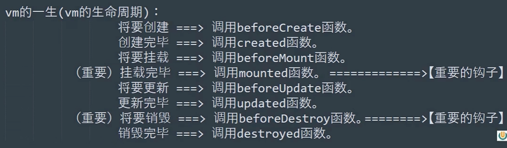

# 13. 生命周期

### 13.1 生命周期的基本概念

- 又称生命周期钩子，是 Vue 实例在创建、更新、销毁时的一些特定方法。
- 生命周期钩子可以让我们在不同的阶段进行一些操作，比如在创建实例时进行数据初始化，在实例更新时执行数据验证，在实例销毁时清理一些事件监听器等。
- 生命周期钩子有多个，我们可以根据不同的需求来选择使用。
- 生命周期函数中的this指向当前Vue实例。

### 13.2 生命周期的调用顺序

- 创建实例：beforeCreate -> created
- 挂载实例：beforeMount -> mounted
- 更新实例：beforeUpdate -> updated
- 销毁实例：beforeDestroy -> destroyed

### 13.3 生命周期函数

- beforeCreate：实例创建之前调用，此时实例的属性、方法都还未初始化。
- created：实例创建之后调用，此时实例的属性、方法都已初始化。
- beforeMount：实例挂载之前调用，此时实例的DOM还未渲染。
- mounted：实例挂载之后调用，此时实例的DOM已经渲染完成。
- beforeUpdate：实例更新之前调用，此时数据变化已经通知到实例，但DOM还未更新。
- updated：实例更新之后调用，此时DOM已经更新，但可能还未重新渲染。
- beforeDestroy：实例销毁之前调用，此时实例的属性、方法都还未清理。
- destroyed：实例销毁之后调用，此时实例已经清理完毕，可以完全删除。

