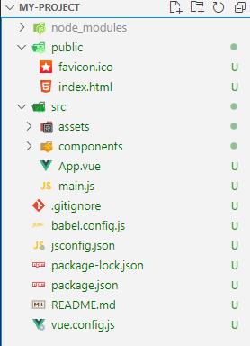
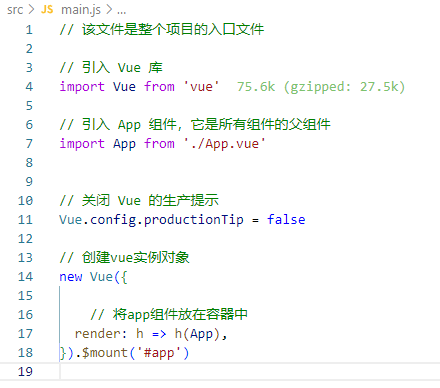
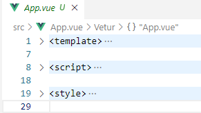
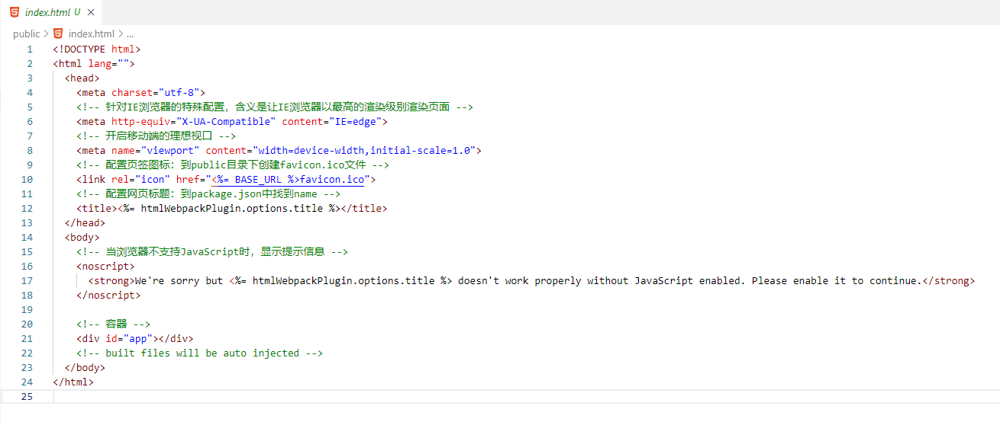

# 16.Vue脚手架

全称Vue CLI(Command Line Interface)，是Vue.js官方提供的脚手架工具，可以快速搭建Vue.js项目，提升开发效率。


### 16.1 安装

#### 16.1.1 全局安装

```
npm install -g @vue/cli
```

#### 16.1.2 创建项目

```
vue create my-project
```

#### 16.1.3 运行项目

```
cd my-project
npm run serve
```

#### 16.1.4 查看webpack配置

```
vue inspect > output.js
```

### 16.2 项目结构



#### 16.2.1 main.js

main.js是Vue项目的入口文件，它包含了创建Vue实例、渲染Vue实例、挂载到DOM等功能。



- 关于不同版本的Vue：
    1. vue.js 与 vue.runtime.js 的区别：
        - vue.js 是完整版的 Vue.js，包含模板编译、数据绑定、事件系统等功能，适合开发大型单页应用。
        - vue.runtime.js 是运行时版的 Vue.js，只包含运行时环境，不包含模板编译、数据绑定、事件系统等功能，适合开发中小型组件库或简单单页应用。

    2. 因为 vue.runtime.js 没有模板编译器，所以不能使用template配置项，需要使用render函数接收到的createElement函数去指定具体内容。

    3. 为了兼容不同版本的 Vue，我们通常会在 package.json 中指定 vue 的依赖版本，如："vue": "^2.0.0"。

#### 16.2.2 App.vue



#### 16.2.3 index.html



