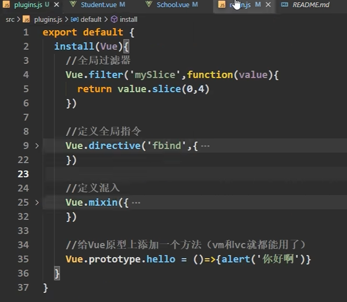
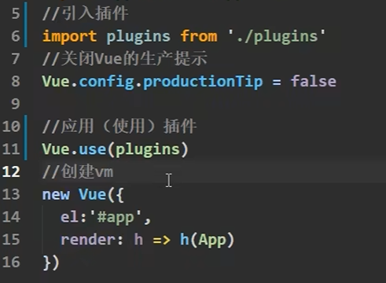
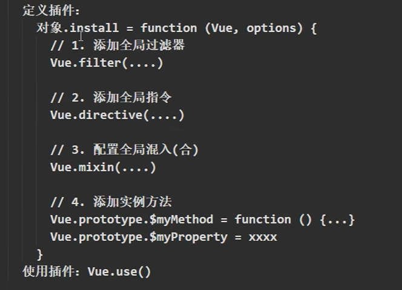

# 21. Plugins

### 21.1 介绍

插件是 Vue.js 的一个重要概念，它可以用来扩展它的功能。插件可以包含全局方法、全局属性、组件、指令等。

插件的使用可以帮助我们解决一些重复性的工作，比如表单验证、日期格式化、Ajax 请求等。

### 21.2 引入与使用

Vue.js 提供了一个官方的插件注册表，里面有很多常用的插件。

注册插件：（install是必须有的函数，其中的第一个参数是Vue构造函数，第二个参数是插件使用者传入的数据）

在main.js中引入插件：

